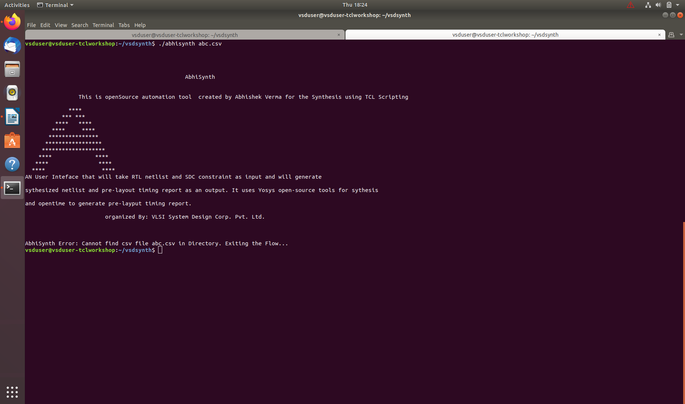

# TCL Workshop: From Introduction to Advanced Scripting Techniques in Design and Synthesis

Author: Abhishek Verma


## Why TCL?

TCL, which stands for Tool Command Language, is a versatile and dynamic scripting language. With its clear and concise syntax, TCL is widely used in various domains, including software development, network administration, and embedded systems. It offers a rich set of built-in commands and supports seamless integration with C/C++ code. 

TCL's flexibility and ease of use make it an excellent choice for both beginners and experienced programmers seeking efficient and powerful scripting capabilities.

## Objective

Create a unique User Interface(UI) that takes RTL netlist & SDC constraints as inputs, and generate synthesized netlsit and Pre-layout timing report as an output. It should use Yosys Open source tool for synthesis and Opentimer to generate pre-layout timing reports

## Steps 


 1.   Create a command and pass .csv file from UNIX shell to tcl script
 2.   Convert excel file content into Yosys readable format (format-y) and .csv file to SDC format using Tcl Programming
 3.   Convert SDC file into Opentimer readable format (format-o) and pass format-y and format-o files to the opentimer timing tool
 4.   Generate output report

## Agenda

[Day-1](#day-1) : Creating a TCL command and pass .csv file from UNIX shell to tcl script

[Day-2](#day-2) : Variable Creation and Processing Constraints from CSV

[Day-3](#day-3) : Processing Clock and Input Constraints

[Day-4](#day-4) : Complete Scripting and Yosys Synthesis

[Day-5](#day-5) : Advanced Scripting Techniques and Quality of Results Generation

### DAY-1: Command creation and passing of .CSV file from UNIX shell as an argument to the TCL script

- Create & Execute the Bash Script

```
#!/bin/tcsh -f
```

- create the Logo/command using the algorithm
```
echo "\t\tThis is openSource automation tool  created by Abhishek Verma for the Synthesis using TCL Scripting"
echo ""
echo "             ****"
echo "           *** ***"
echo "         ****   ****"
echo "        ****     ****"
echo "       ***************"
echo "      *****************"
echo "     *******************"
echo "    ****             ****"
echo "   ****               ****"
echo "  ****                 ****"


echo "AN User Inteface that will take RTL netlist and SDC constraint as input and will generate"
echo ""
echo "sythesized netlist and pre-layout timing report as an output. It uses Yosys open-source tools for sythesis"
echo ""
echo "and opentime to generate pre-layput timing report."

echo ""
echo "\t\t\torganized By: VLSI System Design Corp. Pvt. Ltd."

echo

echo 

echo
```
Give it excute permission.

 ```chmod -R 777 laksh ```


### Scenario 1
- user doesnot provide the .csv file


### Scenario 2:
- user provides the name of .csv file but it doesnot exist
-  

### Scenario 3:
- user requests for help regarding the excel sheet content and execution using --help


### Scenario 4:
- user requests for more than one arguments  


### DesIgn.csv file
- user provided excel formate design file including paths of input , ouput , libraries 


- Source the UNIX shell to tcl script by passing the csv file
```
tclsh my_synth.tcl $argv[1]
```

## DAY-2: Convert all inputs to format[1] and SDC format and pass them to Yosys tool

### Subtasks:
- Creating the variables so that we can access the paths in excel sheet using these
- check if files and directories mentioned in csv exists or not
- Read constraints file in csv and convert to SDC format
- Read all the files in netlist directory
- create main synthesis script into format 2
- pass that script to Yosys

### Variable Creation

- csv file from terminal into tcl file, access it convert it into matrix form
- transfer the contents of matrix to an array so that indexing feature can be used
```
puts "WELCOME TO AbhiSynth"

#------ converts .csv to matrix and creates initial variables "DesignName OutputDirectory NetlistDirectory EarlyLibraryPath LateLibraryPath"----------#
#----------- If you are modifying this script, please use above variables as starting point. Use "puts" command to report above variables-------------#

	set filename [lindex $argv 0]
	package require csv
	package require struct::matrix
	struct::matrix m
	set f [open $filename]
	csv::read2matrix $f m , auto
	close $f
	set columns [m columns]
	#m add columns $columns
	m link my_arr
	set num_of_rows [m rows]
    set i 0

```
- create the variables by removing spaces in their names by using map function
- assign the paths to variables using indexing

```
	while {$i < $num_of_rows} {
		 puts "\nInfo: Setting $my_arr(0,$i) as '$my_arr(1,$i)'"
		 if {$i == 0} {
			 set [string map {" " ""} $my_arr(0,$i)] $my_arr(1,$i)
		 } else {
			 set [string map {" " ""} $my_arr(0,$i)] [file normalize $my_arr(1,$i)]
		 }
		  set i [expr {$i+1}]
	}
} 

puts "\nInfo: Below are the list of initial variables and their values. User can use these variables for further debug. Use 'puts <variable name>' command to query value of below variables"
puts "DesignName = $DesignName"
puts "OutputDirectory = $OutputDirectory"
puts "NetlistDirectory = $NetlistDirectory"
puts "EarlyLibraryPath = $EarlyLibraryPath"
puts "LateLibraryPath = $LateLibraryPath"
puts "ConstraintsFile = $ConstraintsFile"

```


### Check Directories and Files mentioned in csv are available or not?

```
if {! [file exists $EarlyLibraryPath] } {
        puts "\nError : Cannot find early cell library in $EarlyLibraryPath Terminating............. "
        exit
} else {
        puts "\nInfo : early cell library found in $EarlyLibraryPath"
}

if {! [file exists $LateLibraryPath] } {
        puts "\nError : Cannot find late cell library in $LateLibraryPath. Terminating............. "
        exit
} else {
        puts "\nInfo : late cell library found in $LateLibraryPath"
}

if {! [file exists $ConstraintsFile] } {
        puts "\nError : Cannot find Constraints file in $ConstraintsFile. Terminating............. "
        exit
} else {
        puts "\nInfo : Constraints File found in $ConstraintsFile"
}

if {! [file isdirectory $NetlistDirectory] } {
        puts "\nError : Cannot find RTL Netlist Directory in $NetlistDirectory. Terminating............. "
        exit
} else {
        puts "\nInfo : RTL netlist directory  found in $NetlistDirectory."
}

if {! [file isdirectory $OutputDirectory] } {
        puts "\nError : Cannot find RTL Netlist Directory in $OutputDirectory .creating $OutputDirectory "
        file mkdir $OutputDirectory
} else {
        puts "\nInfo :Output directory found at path $OutputDirectory."
}
```
###Check the prescence of paths and names

### return error if the required parameters are not present


### Read Constraint file in csv and convert it to SDC Format

- First dump the SDC constraints


```
#----------------------  Constraints FILE creations--------------------------#
puts "\nInfo: Dumping SDC constraints for $DesignName"
::struct::matrix constraints
set chan [open $ConstraintsFile]
csv::read2matrix $chan constraints  , auto
close $chan
set number_of_rows [constraints rows]
puts "number_of_rows = $number_of_rows"
set number_of_columns [constraints columns]
puts "number_of_columns=$number_of_columns"
 
```

- Categorize all ports as INPUTS OUTPUTS CLOCKS and then process seperately
```
#-----check row number for "clocks" and column number for "IO delays and slew section" in constraints.csv---##
set clock_start [lindex [lindex [constraints search all CLOCKS] 0 ] 1]
set clock_start_column [lindex [lindex [constraints search all CLOCKS] 0 ] 0]
puts "clock start= $clock_start"
puts "clock start_column=$clock_start_column"
```


## Day 3: Mapping openMSP430_design_constraints.csv file to format[1] compatible with Yosys(open source EDA tool) for Synthesis

### Clock latency and transition constraints

Get all the parameters under "CLOCKS",get row and column number and traverse using them.

```
#-------------------clock constraints--------------------##
#-------------------clock latency constraints------------#

set clock_early_rise_delay_start [lindex [lindex [constraints search rect $clock_start_column $clock_start [expr {$number_of_columns-1}] [expr {$input_ports_start-1}]  early_rise_delay] 0 ] 0]

set clock_early_fall_delay_start [lindex [lindex [constraints search rect $clock_start_column $clock_start [expr {$number_of_columns-1}] [expr {$input_ports_start-1}]  early_fall_delay] 0 ] 0]

set clock_late_rise_delay_start [lindex [lindex [constraints search rect $clock_start_column $clock_start [expr {$number_of_columns-1}] [expr {$input_ports_start-1}]  late_rise_delay] 0 ] 0]

set clock_late_fall_delay_start [lindex [lindex [constraints search rect $clock_start_column $clock_start [expr {$number_of_columns-1}] [expr {$input_ports_start-1}]  late_fall_delay] 0 ] 0]

#-------------------clock transition constraints------------#

set clock_early_rise_slew_start [lindex [lindex [constraints search rect $clock_start_column $clock_start [expr {$number_of_columns-1}] [expr {$input_ports_start-1}]  early_rise_slew] 0 ] 0]

set clock_early_fall_slew_start [lindex [lindex [constraints search rect $clock_start_column $clock_start [expr {$number_of_columns-1}] [expr {$input_ports_start-1}]  early_fall_slew] 0 ] 0]

set clock_late_rise_slew_start [lindex [lindex [constraints search rect $clock_start_column $clock_start [expr {$number_of_columns-1}] [expr {$input_ports_start-1}]  late_rise_slew] 0 ] 0]

set clock_late_fall_slew_start [lindex [lindex [constraints search rect $clock_start_column $clock_start [expr {$number_of_columns-1}] [expr {$input_ports_start-1}]  late_fall_slew] 0 ] 0]

```


- Now update te values under these colums for each row into SDC file
```set sdc_file [open $OutputDirectory/$DesignName.sdc "w"]
set i [expr {$clock_start+1}]
set end_of_ports [expr {$input_ports_start-1}]
puts "\nInfo-SDC: Working on clock constraints....."
while { $i < $end_of_ports } {
        puts -nonewline $sdc_file "\ncreate_clock -name [constraints get cell 0 $i] -period [constraints get cell 1 $i] -waveform \{0 [expr {[constraints get cell 1 $i]*[constraints get cell 2 $i]/100}]\} \[get_ports [constraints get cell 0 $i]\]"
	puts -nonewline $sdc_file "\nset_clock_transition -rise -min [constraints get cell $clock_early_rise_slew_start $i] \[get_clocks [constraints get cell 0 $i]\]"
	puts -nonewline $sdc_file "\nset_clock_transition -fall -min [constraints get cell $clock_early_fall_slew_start $i] \[get_clocks [constraints get cell 0 $i]\]"
        puts -nonewline $sdc_file "\nset_clock_transition -rise -max [constraints get cell $clock_late_rise_slew_start $i] \[get_clocks [constraints get cell 0 $i]\]"
        puts -nonewline $sdc_file "\nset_clock_transition -fall -max [constraints get cell $clock_late_fall_slew_start $i] \[get_clocks [constraints get cell 0 $i]\]"
        puts -nonewline $sdc_file "\nset_clock_latency -source -early -rise [constraints get cell $clock_early_rise_delay_start $i] \[get_clocks [constraints get cell 0 $i]\]"
        puts -nonewline $sdc_file "\nset_clock_latency -source -early -fall [constraints get cell $clock_early_fall_delay_start $i] \[get_clocks [constraints get cell 0 $i]\]"
        puts -nonewline $sdc_file "\nset_clock_latency -source -late -rise [constraints get cell $clock_late_rise_delay_start $i] \[get_clocks [constraints get cell 0 $i]\]"
        puts -nonewline $sdc_file "\nset_clock_latency -source -late -fall [constraints get cell $clock_late_fall_delay_start $i] \[get_clocks [constraints get cell 0 $i]\]"
        set i [expr {$i+1}]
}

```


## Inputs

Clock ports are standard ports but the ports under inputports are not standard ports as some are single bit and some are multi bit buses.SO 
- set variables for all the parameters
- indicate if its a bus by appending a '*' in front of the port. we can do this by

    1. get all the netlist files in a serial format ```set netlist [glob -dir $NetlistDirectory *.v] ```
    2. open a temporary file under write mode ```set tmp_file [open /tmp/1 w] ```
    3. now traverse for input ports through all the files and each line in the file until EOF and End of all files
    4. Since we get multiple declarations of the name_to_serach in inputs and outputs, we can split each finding using ';' as a delimiter use lindex[0] to get the first declaration
    5. if there are multiple spaces,remove them and replace with single space as it makes a unique pattern and makes it easy to filter
    6. if number of that unique pattern count is < 2 - its a single bit wire else its a multibit bus
    7. Similar to clock ports ,send the input ports data to SDC file
```

swhile { $i < $end_of_ports } {
#--------------------------optional script----differentiating input ports as bussed and bits------#
set netlist [glob -dir $NetlistDirectory *.v]
set tmp_file [open /tmp/1 w]
foreach f $netlist {
        set fd [open $f]
	puts "reading file $f"
        while {[gets $fd line] != -1} {
		set pattern1 " [constraints get cell 0 $i];"
                if {[regexp -all -- $pattern1 $line]} {
			puts "pattern1 \"$pattern1\" found and matching line in verilog file \"$f\" is \"$line\""
			set pattern2 [lindex [split $line ";"] 0]
			puts "creating pattern2 by splitting pattern1 using semi-colon as delimiter => \"$pattern2\""
			if {[regexp -all {input} [lindex [split $pattern2 "\S+"] 0]]} {
			puts "out of all patterns, \"$pattern2\" has matching string \"input\". So preserving this line and ignoring others"
			set s1 "[lindex [split $pattern2 "\S+"] 0] [lindex [split $pattern2 "\S+"] 1] [lindex [split $pattern2 "\S+"] 2]"
			puts "printing first 3 elements of pattern2 as \"$s1\" using space as demiliter"
			puts -nonewline $tmp_file "\n[regsub -all {\s+} $s1 " "]"
			puts "replace multiple spaces in s1 by single space and reformat as \"[regsub -all {\s+} $s1 " "]\""
			}
                }
        }
close $fd
}
close $tmp_file
set tmp_file [open /tmp/1 r]
#puts "reading [read $tmp_file]"
#puts "reading /tmp/1 file as [split [read $tmp_file] \n]"
#puts "sorting /tmp/1 contents as [lsort -unique [split [read $tmp_file] \n ]]"
#puts "joining /tmp/1 as [join [lsort -unique [split [read $tmp_file] \n ]] \n]"
set tmp2_file [open /tmp/2 w]
puts -nonewline $tmp2_file "[join [lsort -unique [split [read $tmp_file] \n]] \n]"
close $tmp_file
close $tmp2_file
set tmp2_file [open /tmp/2 r]
#puts "count is  [llength [read $tmp2_file]] "
set count [llength [read $tmp2_file]]
#puts "splitting content of tmp_2 using space and counting number of elements as $count"
if {$count > 2} {
	set inp_ports [concat [constraints get cell 0 $i]*]
	puts "bussed"
} else {
	set inp_ports [constraints get cell 0 $i]
	puts "not bussed"
}
	puts "input port name is $inp_ports since count is $count\n"
        puts -nonewline $sdc_file "\nset_input_delay -clock \[get_clocks [constraints get cell $related_clock $i]\] -min -rise -source_latency_included [constraints get cell $input_early_rise_delay_start $i] \[get_ports $inp_ports\]"
        puts -nonewline $sdc_file "\nset_input_delay -clock \[get_clocks [constraints get cell $related_clock $i]\] -min -fall -source_latency_included [constraints get cell $input_early_fall_delay_start $i] \[get_ports $inp_ports\]"
        puts -nonewline $sdc_file "\nset_input_delay -clock \[get_clocks [constraints get cell $related_clock $i]\] -max -rise -source_latency_included [constraints get cell $input_late_rise_delay_start $i] \[get_ports $inp_ports\]"
        puts -nonewline $sdc_file "\nset_input_delay -clock \[get_clocks [constraints get cell $related_clock $i]\] -max -fall -source_latency_included [constraints get cell $input_late_fall_delay_start $i] \[get_ports $inp_ports\]"

        puts -nonewline $sdc_file "\nset_input_transition -clock \[get_clocks [constraints get cell $related_clock $i]\] -min -rise -source_latency_included [constraints get cell $input_early_rise_slew_start $i] \[get_ports $inp_ports\]"
        puts -nonewline $sdc_file "\nset_input_transition -clock \[get_clocks [constraints get cell $related_clock $i]\] -min -fall -source_latency_included [constraints get cell $input_early_fall_slew_start $i] \[get_ports $inp_ports\]"
        puts -nonewline $sdc_file "\nset_input_transition -clock \[get_clocks [constraints get cell $related_clock $i]\] -max -rise -source_latency_included [constraints get cell $input_late_rise_slew_start $i] \[get_ports $inp_ports\]"
        puts -nonewline $sdc_file "\nset_input_transition -clock \[get_clocks [constraints get cell $related_clock $i]\] -max -fall -source_latency_included [constraints get cell $input_late_fall_slew_start $i] \[get_ports $inp_ports\]"


        set i [expr {$i+1}]
}
close $tmp2_file
```
## SDC Contents W.R.T Input ports and Bussed input


## grep all input ports


## SDC Path


## SDC file creation for inputs


## after removing * paths 


## openMSP430.heir.ys file creation 


## DAY-4 : Feeding RTL Netlist and Standard Cell Library to Yosys EDA tool for Synthesis

###YOSYS (Yosys Open SYnthesis Suite)
YOSYS is an open-source RTL synthesis and formal verification framework for digital circuits. It takes RTL descriptions (e.g., Verilog) as input and performs synthesis to generate a gate-level netlist. YOSYS supports technology mapping, optimization, and formal verification. 

## Tasks:
- Checking the Hierarchy
- Error handling
- Synthesize netlist

## Checking the hierarchy 

### case 1 : All the referenced modules are interlinked properly and the hierarchy is properly defined - Hierarchy PASS


### log file regarding no error 


### user output


### case 2 : Hierarchy FAIL


### Log file message regarding the error


### user output fail 


### Completing the synthesis


### output openMSP430.ys 


### error in synthesis due to difference in log 


## DAY-5: Converting Yosys tool's Synthesized Gate Level Output Netlist to a Format compatible with Opentimer(Open Source EDA Tool) for Timing Analysis

### Objective : Generate The Pre-Layout Timing Results


By the end of Day-4 we had synthesized the netlist and we also got an SDC file but inorder to provide it to Opentimer tool, we have to remove out some redundant symbols and lines So that other tool can understand this RAW file

- In the synthesized file
    1. Remove the *s
    2. Remove backslashes
- In the SDC file
    1. Remove brackets
    2. Expand buses
- write a .conf file
- get the count of all violations and their values
- generate the report

### Remove the *s and backslashes
```
set fileid [open /tmp/1 "w"]
puts -nonewline $fileid [exec grep -v -w "*" $OutputDirectory/$DesignName.synth.v]
#grep  -v -w "*" gets alll the instances with * in it so that we can remove them as they arent understood by Opentimer
close $fileid

set output [open $OutputDirectory/$DesignName.final.synth.v "w"]

set filename "/tmp/1"
set fid [open $filename r]
while {[gets $fid line] != -1} {
        puts -nonewline $output [string map {"\\" ""} $line]
        puts -nonewline $output "\n"
}

close $fid
close $output

puts "\nInfo : Please find the final synthesized netlist for $DesignName at below path. You cann use this netlist for STA or PNR"
puts "$OutputDirectory/$DesignName.final.synth.v"
```

### Traking no of * in openMSP430.synth.v


### tranking no of // in openMSP430.synth.value


### For STA and PnR , Final synthesized output nelist 


Now we have to Perform Static Timing Analysis using OpenTimer and for that, We have to modify the SDC file
To do all these, We use PROCS

# PROCS
Procs are an external tcl file that perform an operation that is specified in it when sourced to the main tcl file. It works similar to how a function works in Python Programming. An example of a proc would be read_liberty where options like -lib, -late, -early and /or can be passed as an arguememt to the proc. Once the proc is sourced in the main tcl script the read_liberty command will be executed by referring to the proc and mapping the arguements to the external tcl script(proc script). At the end of the proc command, the main tcl script will be left with the output of the proc.

- So Procs basically allows you to create your own commands

### set_multi_cpu_usage example


### Passing different user string lenghth and checking test.tcl 


### Here I will be creating a proc to source other procs in my main tcl file and its name is proc_help
```
proc proc_help {args} {
        if {$args != "-prochelp"} {
                puts "Invalid Command.... use : -prochelp"
        } else {

                source /home/vsduser/vsdsynth/procs/read_lib.proc
                source /home/vsduser/vsdsynth/procs/read_sdc.proc
                source /home/vsduser/vsdsynth/procs/read_verilog.proc
                source /home/vsduser/vsdsynth/procs/reopenStdout.proc
                source /home/vsduser/vsdsynth/procs/set_num_threads.proc
        }
}
```
As you can see there are 5 procs that i have used to be sourced in main tcl file 
Lets see what each one does

1. reopenStdout.proc
```
proc reopenStdout {file} {
    close stdout
    open $file w
}

```

The reopenStdout proc is a simple proc which is used to close the main terminal stdout and open a file in write mode

2. set_num_threads
```
proc set_multi_cpu_usage {args} {
        array set options {-localCpu <num_of_threads> -help "" }
        #foreach {switch value} [array get options] {
        #puts "Option $switch is $value"
        #}
        while {[llength $args]} {
        #puts "llength is [llength $args]"
        #puts "lindex 0 of \"$args\" is [lindex $args 0]"
                switch -glob -- [lindex $args 0] {
                -localCpu {
                           #puts "old args is $args"
                           set args [lassign $args - options(-localCpu)]
                           #puts "new args is \"$args\""
                           puts "set_num_threads $options(-localCpu)"
                          }
                -help {
                           #puts "old args is $args"
                           set args [lassign $args - options(-help) ]
                           #puts "new args is \"$args\""
                           puts "Usage: set_multi_cpu_usage -localCpu <num_of_threads>"
                      }
                }
        }
}
```

- "array set options { -localCpu <num_of_threads> -help "" }" --> set an array named options. options is a list of key-value pairs, where each key is a string representing the element's name, and each value is the corresponding value to assign to that element. eg, "-localCpu is linked to <num_of_threads>" and "-help" is linked to "".
- "switch -glob -- [lindex $args 0]" --> globbing is used to get the term inside [] so that switch can map to the corresponding case. Takes only the ket of the key-value pair 
- "set args [lassign $args - options(-localCpu)]" --> assigning new value to args after removing the array element which was used to enter the loop

3. read_lib.proc

```
proc read_lib args {
	array set options {-late <late_lib_path> -early <early_lib_path> -help ""}
	while {[llength $args]} {
		switch -glob -- [lindex $args 0] {
		-late {
			set args [lassign $args - options(-late) ]
			puts "set_late_celllib_fpath $options(-late)"
		      }
		-early {
			set args [lassign $args - options(-early) ]
			puts "set_early_celllib_fpath $options(-early)"
		       }
		-help {
			set args [lassign $args - options(-help) ]
			puts "Usage: read_lib -late <late_lib_path> -early <early_lib_path>"
			puts "-late <provide late library path>"
			puts "-early <provide early library path>"
		      }	
		default break
		}
	}
}
```

- Similar to the set_num_threads proc , the read_lib proc will have 3 options i.e _late early and help_
- the proc ensures to read the late and early lib file for STA and write it in a file

4. read_verilog.proc

```
proc read_verilog arg1 {
  puts "set_verilog_fpath $arg1"
}
```
- This proc enters the puts statement followed by the netlist file

5. read_sdc.proc
For this particular proc ,we will make subdivisions of it and look into the functioning

In the SDC file that we generated previously, it had square brackets and additional symbols which the Opentimer tool doesnt recognize. So we use this proc to arrive at a final file format that Opentimer can Use from SDC File

#### 1.Remove the square brackets
```
proc read_sdc {arg1} {
set sdc_dirname [file dirname $arg1]
set sdc_filename [lindex [split [file tail $arg1] .] 0 ]
set sdc [open $arg1 r]
set tmp_file [open /tmp/1 w]

puts -nonewline $tmp_file [string map {"\[" "" "\]" " "} [read $sdc]]
close $tmp_file
```
#### .conf file creation


### read_lib -early and -late , checking updated conf file


### real_verilog


### before after removal of *


#### 2. split the lines based on newline charachter and create clock constraints
```
set tmp_file [open /tmp/1 r]
set timing_file [open /tmp/3 w]
set lines [split [read $tmp_file] "\n"]
set find_clocks [lsearch -all -inline $lines "create_clock*"]
foreach elem $find_clocks {
        set clock_port_name [lindex $elem [expr {[lsearch $elem "get_ports"]+1}]]
        set clock_period [lindex $elem [expr {[lsearch $elem "-period"]+1}]]
        set duty_cycle [expr {100 - [expr {[lindex [lindex $elem [expr {[lsearch $elem "-waveform"]+1}]] 1]*100/$clock_period}]}]
        puts $timing_file "clock $clock_port_name $clock_period $duty_cycle"
        }
close $tmp_file
```


#### 3. Create clock latency and transition constraints
```
#-----------------------------------------------------------------------------#
#----------------converting set_clock_latency constraints---------------------#
#-----------------------------------------------------------------------------#

set find_keyword [lsearch -all -inline $lines "set_clock_latency*"]
set tmp2_file [open /tmp/2 w]
set new_port_name ""
foreach elem $find_keyword {
        set port_name [lindex $elem [expr {[lsearch $elem "get_clocks"]+1}]]
        if {![string match $new_port_name $port_name]} {
                set new_port_name $port_name
                set delays_list [lsearch -all -inline $find_keyword [join [list "*" " " $port_name " " "*"] ""]]
                set delay_value ""
                foreach new_elem $delays_list {
                        set port_index [lsearch $new_elem "get_clocks"]
                        lappend delay_value [lindex $new_elem [expr {$port_index-1}]]
                }
                puts -nonewline $tmp2_file "\nat $port_name $delay_value"
        }
}

close $tmp2_file
set tmp2_file [open /tmp/2 r]
puts -nonewline $timing_file [read $tmp2_file]
close $tmp2_file
#-----------------------------------------------------------------------------#
#----------------converting set_clock_transition constraints------------------#
#-----------------------------------------------------------------------------#

set find_keyword [lsearch -all -inline $lines "set_clock_transition*"]
set tmp2_file [open /tmp/2 w]
set new_port_name ""
foreach elem $find_keyword {
        set port_name [lindex $elem [expr {[lsearch $elem "get_clocks"]+1}]]
        if {![string match $new_port_name $port_name]} {
                set new_port_name $port_name
                set delays_list [lsearch -all -inline $find_keyword [join [list "*" " " $port_name " " "*"] ""]]
                set delay_value ""
                foreach new_elem $delays_list {
                        set port_index [lsearch $new_elem "get_clocks"]
                        lappend delay_value [lindex $new_elem [expr {$port_index-1}]]
                }
                puts -nonewline $tmp2_file "\nslew $port_name $delay_value"
        }
}

close $tmp2_file
set tmp2_file [open /tmp/2 r]
puts -nonewline $timing_file [read $tmp2_file]
close $tmp2_file
```

similarly we do for inputs and outputs , you can refer to this proc under resources section

### enable prelayout timing is 1 ,spef file and update .conf file


### assigning number to every bit of bustes bits


### final netlist in according to opentime formate 


### Final Output file

 Taking worst negative path as arrival time depend on capacitive load and fining no of pin, gate ,nodes , jumps etc


### Creating a .conf file
```

if {$enable_prelayout_timing == 1} {
        puts "\nInfo : enable_prelayout_timing is $enable_prelayout_timing.Enabling zero-wire load parasitics.........."
        set spef_file [open $OutputDirectory/$DesignName.spef w]
        puts $spef_file "*SPEF \"IEEE 1481-1998\""
        puts $spef_file "*DESIGN \"$DesignName\""
        puts $spef_file "*DATE \"Mon Jul 10 06:36:15 2023\""
        puts $spef_file "*VENDOR \"VLSI System Design\""
        puts $spef_file "*PROGRAM \"VSD TCL Workshop\""
        puts $spef_file "*VERSION \"0.0\""
        puts $spef_file "*DESIGN FLOW \"NETLIST_TYPE_VERILOG\""
        puts $spef_file "*DIVIDER /"
        puts $spef_file "*DELIMITER : "
        puts $spef_file "*BUS_DELIMITER [ ]"
        puts $spef_file "*T_UNIT 1 PS"
        puts $spef_file "*C_UNIT 1 FF"
        puts $spef_file "*R_UNIT 1 KOHM"
        puts $spef_file "*L_UNIT 1 UH"
}
close $spef_file

set conf_file [open $OutputDirectory/$DesignName.conf a]
# a in above line end indicates append mode
puts $conf_file "set_spef_fpath $OutputDirectory/$DesignName.spef"
puts $conf_file "init_timer"
puts $conf_file "report_timer"
puts $conf_file "report_wns"
puts $conf_file "report_tns"
puts $conf_file "report_worst_paths -numPaths 10000 "
close $conf_file
                  
```

### Script to generate QOR Quality of Results required to determine performance of our design
one of the prefferred formats for the QOR is horizontal format
```
refer to tcl file for this part 
```

### Formatting to generate the report
```
puts "                                          ****PRELAYOUT TIMING RESULTS****                                        "
set formatStr "%15s %15s %15s %15s %15s %15s %15s %15s %15s"

puts [format $formatStr "----------" "-------" "--------------" "---------" "---------" "--------" "--------" "-------" "-------"]
puts [format $formatStr "DesignName" "Runtime" "Instance Count" "WNS Setup" "FEP Setup" "WNS Hold" "FEP Hold" "WNS RAT" "FEP RAT"]
puts [format $formatStr "----------" "-------" "--------------" "---------" "---------" "--------" "--------" "-------" "-------"]

foreach design_name $DesignName runtime $time_elapsed_in_sec instance_count $Instance_count wns_setup $worst_negative_setup_slack fep_setup $number_of_setup_violations wns_hold $worst_negative_hold_slack fep_hold $number_of_hold_violations wns_rat $worst_RAT_slack fep_rat $number_of_output_violations {
        puts [format $formatStr $design_name $runtime $instance_count $wns_setup $fep_setup $wns_hold $fep_hold $wns_rat $fep_rat]
}

puts [format $formatStr "----------" "-------" "--------------" "---------" "---------" "--------" "--------" "-------" "-------"]
puts "\n"
```

## Final Output


## Code Explaination
